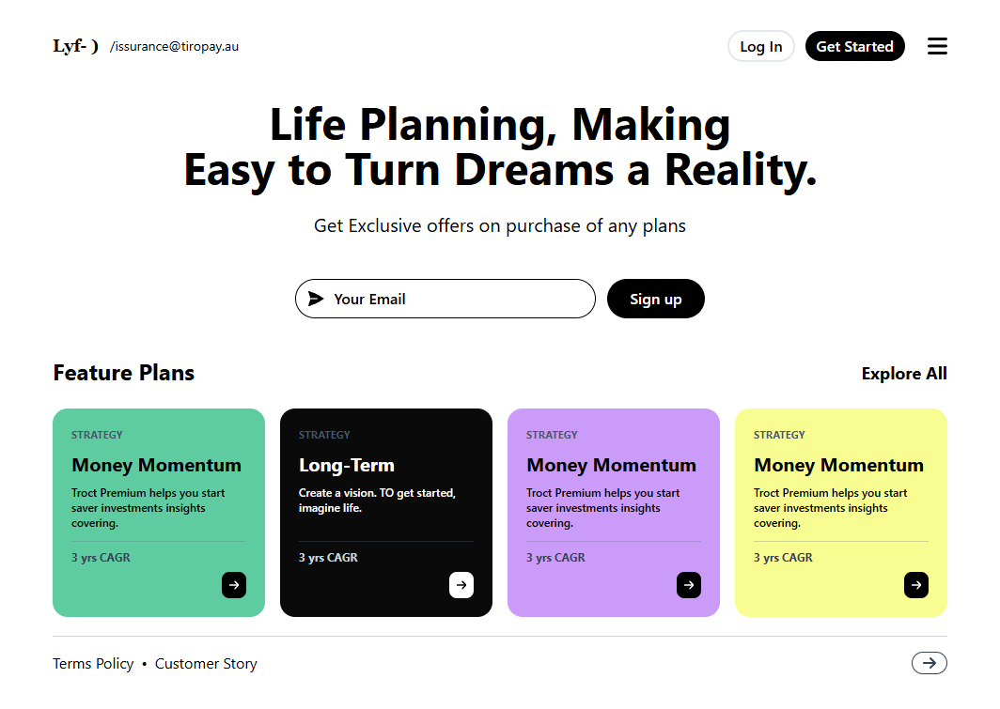

# Next.js DStudio® UI Project

This repository showcases a user interface (UI) project built using **Next.js**. The design of the UI was inspired by the creative and modern aesthetics of [DStudio](https://dribbble.com/shots/21071489-Web-UI) on Dribbble. Below is a preview of the UI design:



The project demonstrates how to implement a visually appealing and functional UI using the latest technologies.

---

## Getting Started

### Prerequisites

Ensure you have the following installed on your machine:

- [Node.js](https://nodejs.org/) (v16 or later recommended)
- [npm](https://www.npmjs.com/) or [yarn](https://yarnpkg.com/)

### Installation

1. Clone the repository:

   ```bash
   git clone https://github.com/your-username/your-repo-name.git
   cd your-repo-name
   ```

2. Install dependencies:

   ```bash
   npm install
   # or
   yarn install
   ```

### Running the Application

To start the development server:

```bash
npm run dev
# or
yarn dev
```

The app will be available at [http://localhost:3000](http://localhost:3000).


To format code with Prettier:

```bash
npm run format
# or
yarn format
```

---

## Folder Structure

```plaintext
├── public        # Static assets like images, fonts, etc.
├── global.css        # Global styles or CSS modules
├── components    # Reusable components
├── pages         # Next.js pages
├── .eslintrc.config.mjs  # ESLint configuration
├── package.json  # Project dependencies
└── README.md     # Project documentation
```

---

## License

This project is licensed under the MIT License. See the [LICENSE](LICENSE) file for more details.

---

## Acknowledgments

- Design inspiration from [DStudio](https://dribbble.com/shots/21071489-Web-UI).
- Thanks to the Next.js and open-source community for the tools and support.